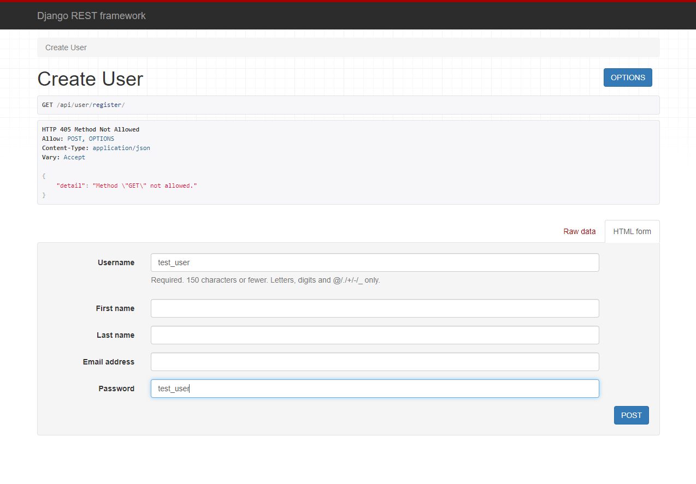
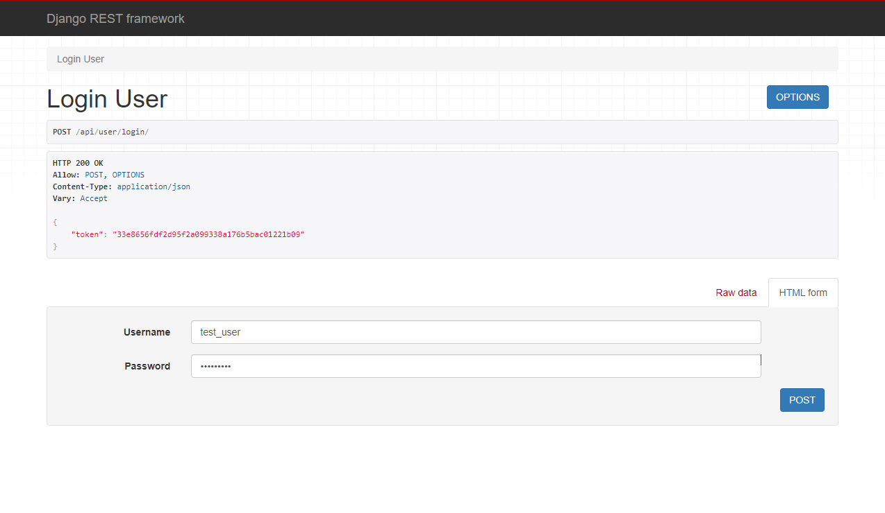
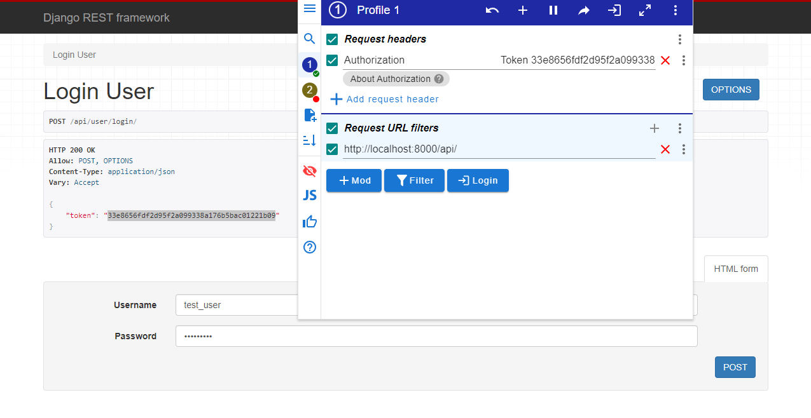
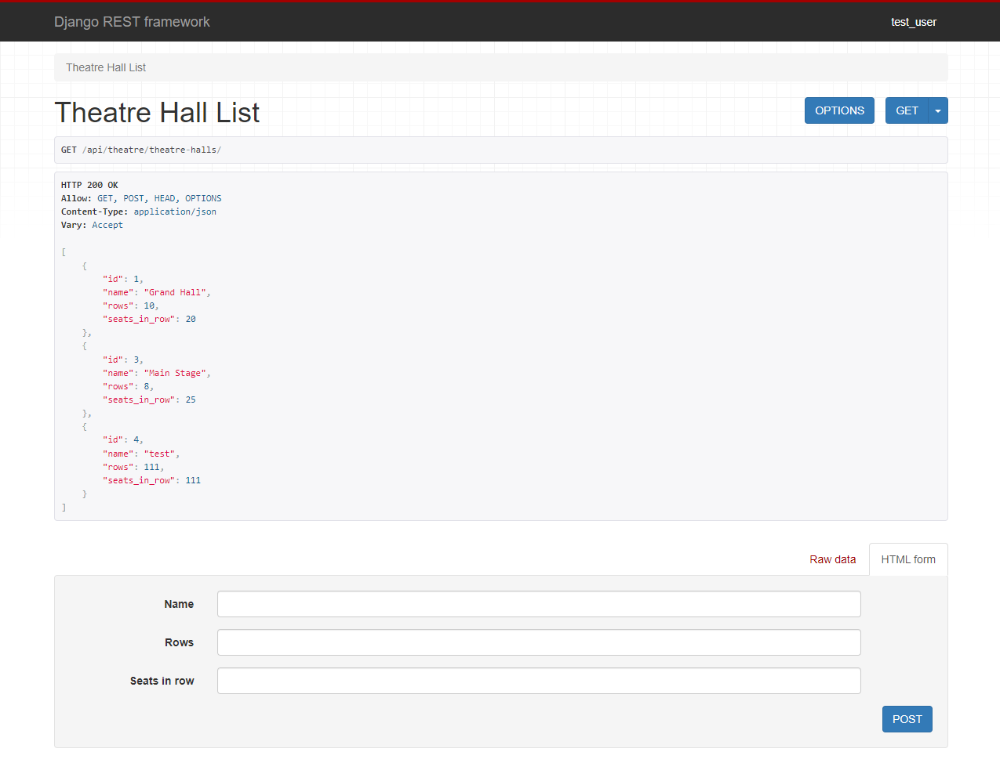
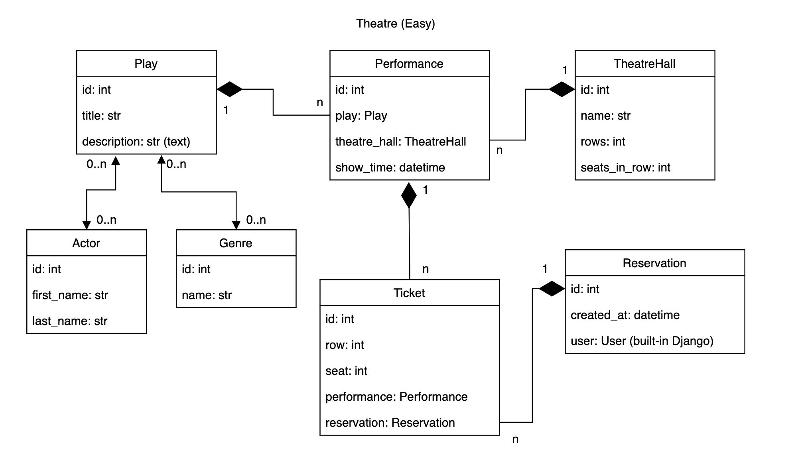

# Theatre API Service


## Description
This API is designed for a local theater, allowing visitors to make online reservations, choose seats, and manage bookings. It includes endpoints for user registration, login, and access to theater data such as plays, performances, and genres.


## Technologies Used
- Python
- Django ORM
- Django
- DRF
- Docker


## Setup
To install the project locally on your computer, execute the following commands in a terminal:
```bash
git clone https://github.com/Illya-Maznitskiy/theatre-api-service.git
cd theatre-api-service
python -m venv venv
venv\Scripts\activate (on Windows)
source venv/bin/activate (on macOS)
pip install -r requirements.txt
```


## Commands to test the project:
You can run the tests and check code style using `flake8` with the following commands:

```
python manage.py test
flake8
```


## Docker Configuration
### _Dockerfile_
Configures the Django app environment, installs dependencies, sets the working directory, and manages media file permissions

### _docker-compose.yml_
This file sets up the Docker services, including the Django application and PostgreSQL database:

### _Environment Variables (.env)_
These variables configure the PostgreSQL database connection. Create a `.env` file in the root directory of the project and add the necessary database configuration. Example content:
```env
DB_NAME=your_database_name
DB_USER=your_database_user
DB_PASSWORD=your_database_password
DB_HOST=db
DB_PORT=5432
PGDATA=/var/lib/postgresql/data
```


## Docker Setup
To set up and run the project using [Docker](https://www.docker.com/get-started/), follow these steps:

- Use `http://localhost:8001/` URL to visit the service when it starts.

1. **Ensure Docker is Running**:
    ```text
    Make sure Docker Desktop is installed and running on your system.
    ```

2. **Build the Docker Images**:
    ```bash
    docker-compose build
    ```

3. **Start the Services**:
    ```bash
    docker-compose up
    ```

4. **Stop the Services**:
    ```bash
    docker-compose down
    ```


## Access
- **Superusers**: Can modify all data (e.g., add, update, delete entries) in the Theatre API.
- **Authenticated Users**: Can view data and create reservations and tickets but cannot modify existing data.
To create a superuser, use the following command:

```bash
python manage.py createsuperuser
```
After creating the superuser, you can log in using these credentials on the /api/user/login/ page to get your authentication token. This token can be used for authorized access to the Theatre API.


## API Endpoints

### User API
- **URL:** `/api/user/register/`
- **URL:** `/api/user/login/`
- **URL:** `/api/user/me/`

### Theatre API
- **URL:** `/api/theatre/theatre-halls/`
- **URL:** `/api/theatre/plays/`
- **URL:** `/api/theatre/performances/`
- **URL:** `/api/theatre/actors/`
- **URL:** `/api/theatre/genres/`
- **URL:** `/api/theatre/reservations/`
- **URL:** `/api/theatre/tickets/`


## Screenshots:
_There are examples how to use the project with DRF API interface in browser with a [ModHeader](https://modheader.com/docs/using-modheader/modify-request-headers) extension
 (alternatively, [Postman](https://learning.postman.com/docs/introduction/overview/) or similar services can be used)_

### User registration example:
This screenshot shows the form where new users can create an account.


### User login by page:
Here’s a demonstration of the login page where users receive their tokens.


### User login by ModHeader:
Use the ModHeader extension to send the token and allow access to other pages.


### Theatre API Overview:
If you correctly use the authentication token, you'll have access to the Theatre API.


## Database structure:

